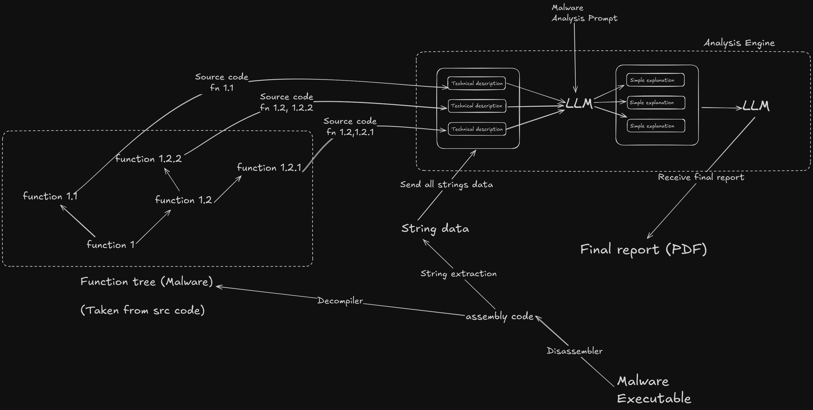

<div align="center">

  


  
# SecureX - lumen
### Advanced Ai-based Malware Analysis as a Service (Ai-MaaS) 
> Revealing the Dark Side of Malware with AI-powered Threat Intelligence 

</div> 



## Installation
clone the repo
```
git clone https://github.com/spirizeon/lumen.git
cd lumen
docker build . -t lumen

```
use Docker hub
```
docker pull delcagox/lumen
```

run the container
```
docker run -itp 8000:8000 5173:5173
```

## Endpoints 

